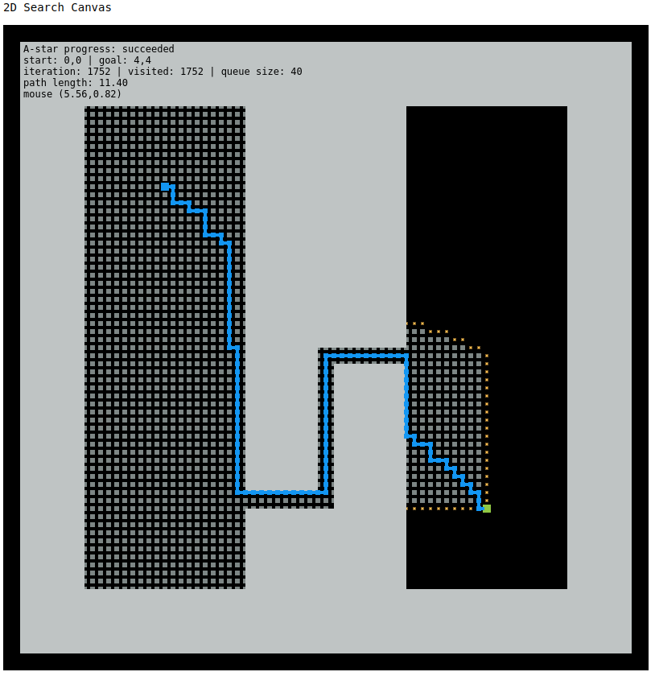
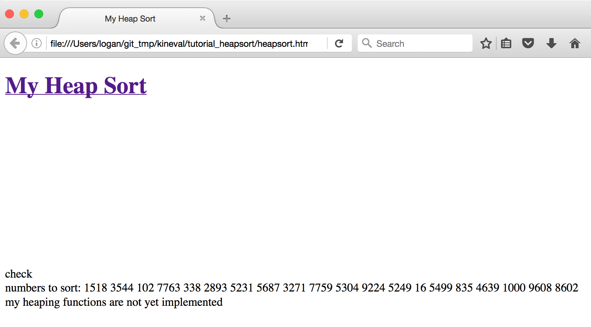
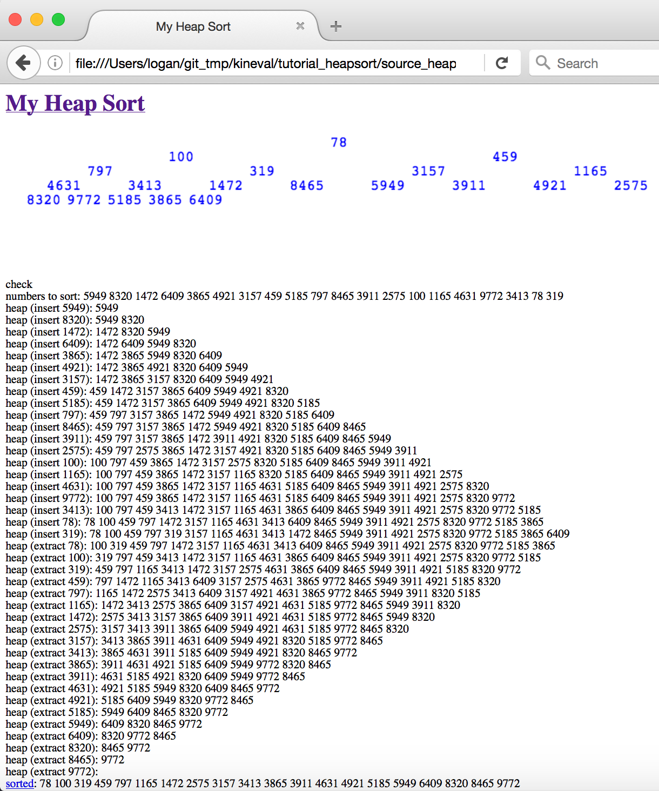
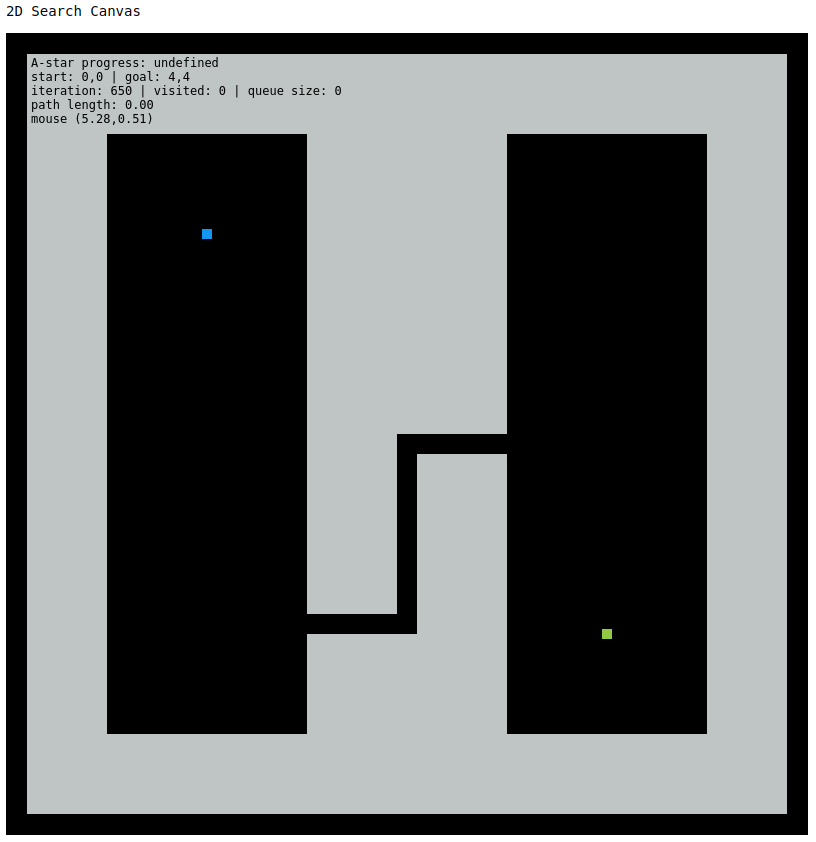

# Assignment 1: Path Planning

!!! note "Archived project from a previous AutoRob semester"
    This page preserves a project write-up from a past offering of AutoRob (Winter 2023 and
    earlier, using the JavaScript/HTML5 KinEval stencil). It is kept here as a preview of past
    coursework and is **not** an active assignment in the current semester. File paths, due
    dates, and submission mechanics below refer to that earlier offering's KinEval-based
    workflow, not the current Agentic Edition pubsub infrastructure.

**Due 11:59pm, Monday, January 30, 2023**

The objective of the first assignment is to implement a collision-free path planner in JavaScript/HTML5. Path planning is used to allow robots to autonomously navigate in environments from previously constructed maps. A path planner essentially finds a set of waypoints (or setpoints) for the robot to traverse and reach its goal location without collision. As covered in other courses (EECS 467, ROB 550, or ROB 530), such maps can be estimated through methods for [simultaneous localization and mapping](https://en.wikipedia.org/wiki/Simultaneous_localization_and_mapping). Below is an example from [EECS 467](https://www.youtube.com/playlist?list=PLDutmfAv2lfZ9M0XyYfY4N8EwLJhy58G6) where a [robot performs autonomous navigation](https://youtu.be/c-e12F_QqiM) while simultaneously building an occupancy grid map:

For this assignment, you will implement the planning part of autonomous navigation as an A-star graph search algorithm. Unlike in the above video, where the map is built as the robot explores, you will be given a complete map of the robot's world to run A-star on. A-star infers the shortest path from a start to a goal location in an arbitrary 2D world with a known map (or collision geometry). This A-star implementation will consider locations in a uniformly spaced, 4-connected grid. A-star requires an [admissible heuristic](https://en.wikipedia.org/wiki/Admissible_heuristic), which can be the [Euclidean distance](https://en.wikipedia.org/wiki/Euclidean_distance) to the goal in your implementation. You will implement a heap data structure as a priority queue for visiting locations in the search grid.

If properly implemented, the A-star algorithm should produce the following path (or path of similar length) using the provided code stencil:

### Features Overview

This assignment requires the following features to be implemented in the corresponding files in your repository:

-   Heap implementation in "tutorial\_heapsort/heap.js"
    
-   A-star search in "project\_pathplan/graph\_search.js"
    

Points distributions for these features can be found in the [project rubric section](../policies/grading.md#project-rubrics-tentative-and-subject-to-change). More details about each of these features and the implementation process are given below.

### Cloning the Stencil Repository

If you have not done so already, the first step for completing this project (and all projects for AutoRob) is to clone the [KinEval stencil repository](https://github.com/lizolson/kineval-stencil). The appended git quick start below is provided those unfamiliar with git to perform this clone operation, as well as commiting and pushing updates for project submission. **IMPORTANT**: the stencil repository should be cloned and **not forked** -- and we will this single repository for all projects in the course.

Each student in this class is responsible for providing a git repository for submitting their project work and receiving grading feedback. Use of the GitHub classroom is available as a complementary service that provides repositories free for student use. If a student is uncomfortable using the GitHub service, the [EECS GitLab Server](https://gitlab.umich.edu/) is a service within the University of Michigan and is available for creation of student repositories.

If you choose to use GitHub, you can join our [autorob-WN23 GitHub Classroom](https://classroom.github.com/a/0ieHZNvR). By following the preceeding link, your GitHub account will be linked to our 'classroom' and a private clone of the [KinEval stencil repository](https://github.com/autorob-WN22/kineval-stencil) will be created for you to use. Your private repository will automatically be named `kineval-stencil-<username>`.

Throughout the KinEval code stencil, there are markers with the string "STENCIL" for code that needs to be completed for course projects. For this assignment, you will write code where indicated by the "STENCIL" marker in "tutorial\_heapsort/heap.js" and "project\_pathplan/graph\_search.js".

### Heap Sort Tutorial

The starting point for this assignment is to complete the heap sort implementation in the "tutorial\_heapsort" subdirectory of the stencil repository. In this directory, a code stencil in JavaScript/HTML5 is provided in two files: "heapsort.html" and "heap.js". Comments are provided throughout these files to describe the structure of JavaScript/HTML5 and its programmatic features.

If you are new to JavaScript/HTML5, there are other tutorial-by-example files in the "tutorial\_js" directory. Any of these files can be run by simply opening them in a web browser. Note that these are examples _only_, and there are no assignment requirements in the "tutorial\_js" files.

Opening "heapsort.html" will show the result of running the incomplete heap sort implementation provided by the code stencil:

To complete the heap sort implementation, complete the heap implementation in "heap.js" at the locations marked "STENCIL". In addition, the inclusion of "heap.js" in the execution of the heap sort will require modification of "heapsort.html".

A successful heap sort implementation will show the following result for a randomly generated set of numbers:

### Graph Search Stencil

For the path planning implementation, a JavaScript/HTML5 code stencil has been provided in the "project\_pathplan" subdirectory. The main HTML file, "search\_canvas.html", includes JavaScript code from "draw.js", "infrastructure.js", "graph\_search.js", and the "/scenes" directory. Of these files, students must only edit "graph\_search.js", although you may want to examine the other files to understand the available helper functions. There will also be an optional activity involving adding new planning scene files under the "/scenes" directory. Opening "search\_canvas.html" in a browser should display an empty 2D world displayed in an [HTML5 canvas](http://www.w3schools.com/html/html5_canvas.asp) element.

There are five provided planning scenes under the "/scenes" directory within this code stencil: "empty.js", "misc.js", "narrow1.js", "narrow2.js", and "three\_sections.js". The choice of planning\_scene can be specified from the URL given to the browser, as described in comments in "search\_canvas.html". For example, the URL "search\_canvas.html?planning\_scene=scenes/narrow2.js" will bring up the "narrow2.js" planning world shown above. Other execution parameters, such as start and goal location, can also be specified through the document URL. A description of these parameters is also provided in "search\_canvas.html".

This code stencil is implemented to perform graph search iterations interactively in the browser. The core of the search implementation is performed by the function iterateGraphSearch(). This function performs a graph search iteration for a single location in the A-star execution. The browser implementation cannot use a while loop over search iterations, as in the common A-star implementation. Such a while loop would keep control within the search function, and cause the browser to become non-responsive. Instead, the iterateGraphSearch() gives control back to the main animate() function, which is responsible for updating the display and user interaction.

Within the code stencil, you will complete the functions initSearchGraph() and iterateGraphSearch() as well as add functions for heap operations. Locations in "graph\_search.js" where code should be added are labeled with the "STENCIL" string.

The initSearchGraph() function creates a 2D array over graph cells to be searched. Each element of this array contains various properties computed by the search algorithm for a particular graph cell. Remember, a graph cell represents a square region of space in the 2D planning scene. The size of each cell is specified by the "eps" parameter, as the lengths of the square sides. initSearchGraph() must determine the start node for accessing the planning graph from the start pose of the robot, specified as a 2D vector in parameter "q\_init". The visit queue is initialized as this start node.

The iterateGraphSearch() function should perform a search iteration towards the goal pose of the robot, specified as a 2D vector in parameter "q\_goal". The search must find a goal node that allows for departure from the planning graph without collision. iterateGraphSearch() makes use of three provided helper functions. testCollision(\[x, y\]) returns a boolean of whether a given 2D location, as a two-element vector \[x, y\], is in collision with the planning scene. draw\_2D\_configuration(\[x, y\], type) draws a square at a given location in the planning world to indicate that location has been visited by the search (type = "visited") or is currently in the planning queue (type = "queued"). Once the search is complete, drawHighlightedPathGraph(l) will render the path produced by the search algorithm between location l and the start location. The global variable search\_iterate should be set to false when the search is complete to end animation loop.

### Graduate Section Requirement

In addition to the A-star algorithm, students in the graduate section of AutoRob must additionally implement path planning by Depth-first search, Breadth-first search, and Greedy best-first search. An additional report is required in "report.html" (you will need to create this file) in the "project\_pathplan" directory. This report must: 1) show results from executing every search algorithm with every planning world for various start and goal configurations and 2) synthesize these results into coherent findings about these experiments.

For effective communication, it is recommended to think of "report.html" like a short research paper: motivate the problem, set the value proposition for solving the problem, describe how your methods can address the problem, and show results that demonstrate how well these methods realize the value proposition. Visuals are highly recommended to complement this description. The best research papers can be read in three ways: once in text, once in figures, and once in equations. It is also incredibly important to remember that writing in research is about generalizable understanding of the problem more than a specific technical accomplishment.

#### Optional Extensions

Optional extensions can be submitted anytime before the final grading is complete. Concepts for several of these extensions will not be covered until later in the semester. Any new path planning algorithm must be implemented within its own ".js" file under the "project\_pathplan" directory, and invoked through a parameter given through the URL. For example, the Bug0 algorithm must be invoked by adding the argument "?search\_alg="Bug0" to the URL. Thus, a valid invocation of Bug0 for the Narrow2 world could use the URL (for the appropriate location of the file on your computer's filesystem):

`file:///myfilesystem/kineval-stencil/project_pathplan/search_canvas.html?planning_scene=scenes/narrow2.js?search_alg="Bug0`

The same format must be used to invoke any other algorithm (such as Bug1, Bug2, TangentBug, Wavefront, etc.). Note that you will need to update the animate loop in draw.js to include new planning algorithms and update the main HTML file to include your new scripts, along with implementing the algorithms in their own files.

Of the possible optional extension points, two additional points for this assignment can be earned by implementing the "Bug0", "Bug1", "Bug2", and "TangentBug" navigation algorithms. The implementation of these bug algorithms must be contained within the file "bug.js" under the "project\_pathplan" directory.

Of the possible optional extension points, two additional points for this assignment can be earned by implementing navigation by "Potential" fields and navigation using the "Wavefront" algorithm. The implementation of these potential-based navigation algorithms must be contained within the file "field\_wave.js" under the "project\_pathplan" directory.

Of the possible optional extension points, one additional point for this assignment can be earned by implementing a navigation algorithm using a probabilistic roadmap ("PRM"). This roadmap algorithm implementation must be contained within the file "prm.js" under the "project\_pathplan" directory.

Of the possible optional extension points, one additional point for this assignment can be earned by implementing costmap functionality using morphological operators. Based on the computed costmap, the navigation routine would provide path cost in addition path length for a successful search. The implementation of this costmap must be contained within the file "costmap.js" under the "project\_pathplan" directory.

Of the possible optional extension points, one additional point for this assignment can be earned by implementing a priority queue through an [AVL tree](https://en.wikipedia.org/wiki/AVL_tree) or a [red-black tree](https://en.wikipedia.org/wiki/Red%E2%80%93black_tree). The implementation of this priority queue must be contained within the file "balanced\_tree.js" under the "project\_pathplan" directory.

Of the possible optional extension points, one additional point for this assignment can be earned by adapting the search canvas to plan betwen any locations in the map "bbb2ndfloormap.png" (provided in the stencil repository) when the "planning\_scene" parameter is invoked as "BeysterFloor2".

### Project Submission

For turning in your assignment, ensure your completed project code has been committed and pushed to the _master_ branch of your repository.

To ensure proper submission of your assignments, please make sure the following have been done from Project 0:

-   complete the [AutoRob Winter 2022 Student Workflow Survey](https://forms.gle/uEfkN8aPWaYZ87K3A), making sure you provide your GitHub username
    
-   ensure the instructor and all IAs have push/admin access to your repository, which can be confirmed/addressed through slack, email, or office hours
    

###### If you are paying attention, you should also add a directory to your repository called "me". This "me" directory should include a simple webpage in the file "me.html". The "me.html" file should have a title with your name, an h1 tag with your name, body with a brief introduction about you, and a script tag that prints the result of `Array(16).join("wat"-1)+" Batman!"` to the console.

* * *
