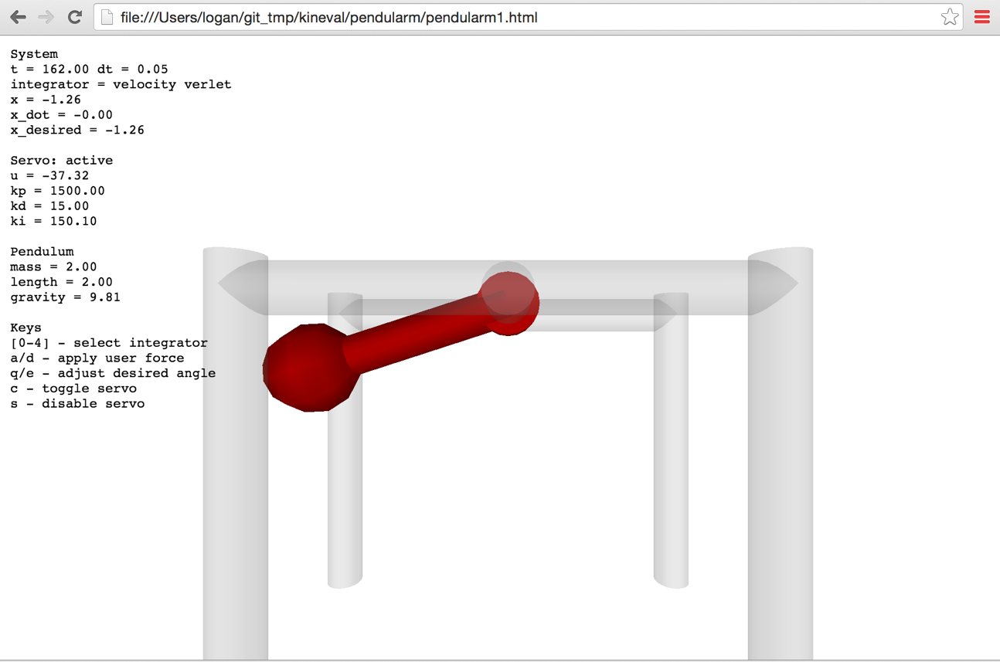

# Assignment 2: Pendularm

!!! note "Archived project from a previous AutoRob semester"
    This page preserves a project write-up from a past offering of AutoRob (Winter 2023 and
    earlier, using the JavaScript/HTML5 KinEval stencil). It is kept here as a preview of past
    coursework and is **not** an active assignment in the current semester. File paths, due
    dates, and submission mechanics below refer to that earlier offering's KinEval-based
    workflow, not the current Agentic Edition pubsub infrastructure.

**Due 11:59pm, Monday, February 13, 2023**

Physical simulation is widely used across robotics to test robot controllers. Testing in simulation has many benefits, such as avoiding the risk of damaging a (likely expensive) robot and faster development of controllers. Simulation also allows for consideration of environments not readily available for testing, such as interplanetary exploration (as in the example below for the NASA Space Robotics Challenge). We will now model and control our first robot, the Pendularm, to achieve an arbitrary desired setpoint state.

As an introduction to building your own robot simulator, your task is to implement a physical dynamics and servo controller for a simple 1 degree-of-freedom robot system. This system is 1 DOF robot arm as a frictionless [simple pendulum](http://en.wikipedia.org/wiki/Pendulum) with a rigid massless rod and idealized motor. A visualization of the Pendularm system is shown below. Students in the graduate section will extend this system into a 2-link 2-DOF robot arm, as an actuated [double pendulum](https://en.wikipedia.org/wiki/Double_pendulum).

## Features Overview

This assignment requires the following features to be implemented in the corresponding files in your repository:

-   Euler integrator in "project\_pendularm/update\_pendulum\_state.js"
    
-   Velocity Verlet integrator in "project\_pendularm/update\_pendulum\_state.js"
    
-   PID controller in "project\_pendularm/update\_pendulum\_state.js"
    
-   _\[Grad section only\]_ Verlet integrator in "project\_pendularm/update\_pendulum\_state.js"
    
-   _\[Grad section only\]_ Runge-Kutta 4 integrator in "project\_pendularm/update\_pendulum\_state.js"
    
-   _\[Grad section only\]_ Double pendulum implementation in "project\_pendularm/update\_pendulum\_state2.js"
    

Points distributions for these features can be found in the [project rubric section](../policies/grading.md#grading-breakdown). More details about each of these features and the implementation process are given below.

## Implementation Instructions

The code stencil for the Pendularm assignment is available within the "project\_pendularm" subdirectory of KinEval.

For physical simulation, you will implement several numerical integrators for a pendulum with parameters specified in the code stencil. The numerical integrator will advance the state of the pendulum (angle and velocity) in time given the current acceleration, which your pendulum\_acceleration function should compute using the pendulum equation of motion. Your code should update the angle and velocity in the pendulum object (pendulum.angle and pendulum.angle\_dot) for the visualization to access. If implemented successfully, this ideal pendulum should oscillate about the vertical (where the angle is zero) and with an amplitude that preserves the initial height of the pendulum bob.

Students enrolled in the undergraduate section will implement numerical integrators for:

-   [Euler's Method](http://en.wikipedia.org/wiki/Euler%27s_method)
    
-   [Velocity Verlet](http://en.wikipedia.org/wiki/Verlet_integration#Velocity_Verlet)
    

For motion control, students in both undergraduate sections will implement a [proportional-integral-derivative controller](http://en.wikipedia.org/wiki/PID_controller) to control the system's motor to a desired angle. This PID controller should output control forces integrated into the system's dynamics. You will need to tune the gains of the PID controller for stable and timely motion to the desired angle for a pendulum with parameters: length=2.0, mass=2.0, gravity=9.81. These default values are also provided directly in the init() function.

For user input, you should be able to:

-   select the choice of integrator using the \[0-4\] keys (with the "none" integrator as a default),
    
-   toggle the invocation of the servo controller with the 'c' or 'x' key (which is off by default),
    
-   decrement and increment the desired angle of the 1 DOF servoed robot arm using the 'q' and 'e' keys, and
    
-   (for the double pendulum) decrement and increment the desired angle of the second joint of the arm using the 'w' and 'r' keys, and
    
-   momentarily disable the servo controller with 's' key (and allowing the arm to swing uncontrolled).
    

## Graduate Section Requirement

Students enrolled in the graduate section will implement numerical integrators for:

-   [Euler's Method](http://en.wikipedia.org/wiki/Euler%27s_method)
    
-   [Verlet integration](https://en.wikipedia.org/wiki/Verlet_integration#Verlet_integration_.28without_velocities.29)
    
-   [Velocity Verlet](http://en.wikipedia.org/wiki/Verlet_integration#Velocity_Verlet)
    
-   [Runge-Kutta 4](https://en.wikipedia.org/wiki/Runge%E2%80%93Kutta_methods#The_Runge.E2.80.93Kutta_method)
    

to simulate and control a single pendulum (in "update\_pendulum\_state.js"). Then, students in the graduate section will implement **one** of the above integrators for a double pendulum (in "update\_pendulum\_state2.js"). Any of the integrators may work as your choice for the double pendulum implementation, although the Runge-Kutta integrator is recommended. The double pendulum is allowed to have a smaller timestep than the single pendulum, within reasonable limits. A working visualization for the double pendularm will look similar to [this result video](https://youtu.be/-8YH1JhklBw) by [mamantov](https://github.com/emgoeddel):

## Optional Extensions

Of the possible optional extension points, one additional point for this assignment can be earned by generating a random desired setpoint state and using PID control to your Pendularm to this setpoint. This code must randomly generate a new desired setpoint and resume PID control once the current setpoint is achieved. **A setpoint is considered achieved if the current state matches the desired state up to 0.01 radians for 2 seconds.** The number of setpoints that can be achieved in 60 seconds must be maintained and reported in the user interface. The invocation of this setpoint trial must be enabled a user pressing the "t" key in the user interface.

Of the possible optional extension points, two additional points for this assignment can be earned by implementing a simulation of a planar [cart pole system](https://en.wikipedia.org/wiki/Inverted_pendulum). This cartpole system should have joint limits on its prismatic joint and no motor forces applied to the rotational joint. This cart pole implementation should be contained within the file "cartpole.html" under the "project\_pendularm" directory.

Of the possible optional extension points, two additional points for this assignment can be earned by implementing a single pendulum simulator in maximal coordinates with a spring constraint enforced by [Gauss-Seidel optimization](https://en.wikipedia.org/wiki/Verlet_integration#Constraints). This maximal coordinate pendulum implementation should be contained within the file "pendularm1\_maximal.html" under the "project\_pendularm" directory. An additional point can be earned by extending this implementation to a cloth simulator in the file "cloth\_pointmass.html".

Of the possible advanced extension points, three additional points for this assignment can be earned by developing and implementing a maximal coordinate dynamical simulation of biped hopper with links as planar 2D rigid bodies capable of locomotion on a flat ground plane. This maximal coordinate pendulum implementation should be contained within the file "hopper\_planar.html" under the "project\_pendularm" directory.

Of the possible optional extension points, one additional point for this assignment can be earned by implementing a plot visualization of the state and desired setpoint for the 1 DoF pendulum over a 20 second window (of simulation time) within the pendularm1.html user interface. The Pendularm user interface must maintain at least the same usability as the provided pendularm1.html implementation.

## Project Submission

For turning in your assignment, push your updated code to the **master** branch in your repository.
