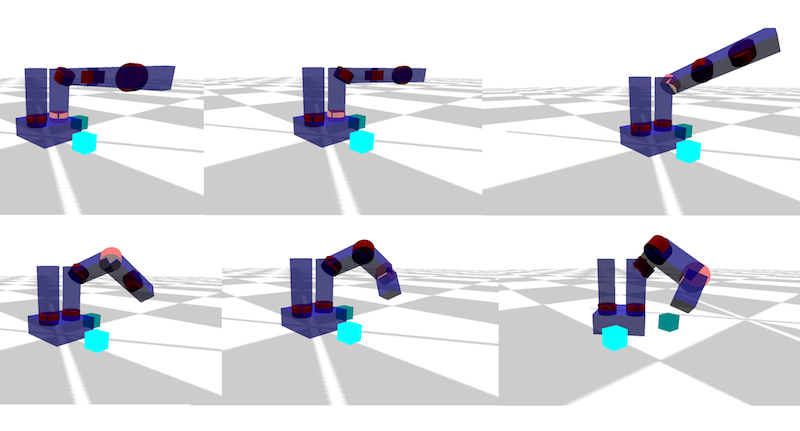

# Assignment 4: Robot FSM Dance Contest

!!! note "Archived project from a previous AutoRob semester"
    This page preserves a project write-up from a past offering of AutoRob (Winter 2023 and
    earlier, using the JavaScript/HTML5 KinEval stencil). It is kept here as a preview of past
    coursework and is **not** an active assignment in the current semester. File paths, due
    dates, and submission mechanics below refer to that earlier offering's KinEval-based
    workflow, not the current Agentic Edition pubsub infrastructure.

**Due 11:59pm, Monday, March 13, 2023**

Executing choreographed motion is the most common use of current robots. Robot choreography is predominantly expressed as a sequence of setpoints (or desired states) for the robot to achieve in its motion execution. This form of robot control can be found among a variety of scenarios, such as robot dancing (video below), GPS navigation of autonomous drones, and automated manufacturing. General to these robot choreography scenarios is a given setpoint controller (such as our PID controller from Pendularm) and a sequence controller (which we will now create).

For this assignment, you will build your own robot choreography system. This choreography system will enable a robot to execute a dance routine by adding motor rotation to its joints and creating a Finite State Machine (FSM) controller over pose setpoints. Your FK implementation will be extended to consider angular rotation about each joint axis using quaternions for axis-angle rotation. The positioning of each joint with respect to a given pose setpoint will be controlled by a simple P servo implementation (based on the Pendularm assignment). You will implement an FSM controller to update the current pose setpoint based on the robot's current state and predetermined sequence of setpoints. For a single robot, you will choreograph a dance for the robot by creating an FSM with your design of pose setpoints and an execution sequence.

This controller for the "mr2" example robot was a poor attempt at [robot Saturday Night Fever](https://www.youtube.com/watch?v=YxvBPH4sArQ&feature=youtu.be&t=107) (please do better):

[](../assets/images/diagrams/asgn4_joint_rotation.png)

This [updated dance](https://www.youtube.com/embed/WyQ9aoB3bpI) controller for the Fetch robot is a bit better, but still very far from optimal:

## Features Overview

This assignment requires the following features to be implemented in the corresponding files in your repository:

-   Quaternion joint rotation in "kineval/kineval\_quaternion.js" (for quaternion functions) and "kineval/kineval\_forward\_kinematics" (to add axis-angle joint rotation to existing kinematic traversal)
    
-   Interactive base control vectors in "kineval/kineval\_forward\_kinematics.js"
    
-   Pose setpoint controller in "kineval/kineval\_servo\_control.js"
    
-   Dance FSM in "kineval/kineval\_servo\_control.js" (FSM controller) and "home.html" (dance setpoint initialization)
    
-   \[Grad section only\] Joint limit enforcement in "kineval/kineval\_controls.js"
    
-   \[Grad section only\] Prismatic joint implementation in "kineval/kineval\_forward\_kinematics.js"
    
-   \[Grad section only\] Fetch *rosbridge* interface
    

Points distributions for these features can be found in the [project rubric section](../policies/grading.md#grading-breakdown). More details about each of these features and the implementation process are given below.

## Joint Axis Rotation and Interactive Joint Control

Going beyond the joint properties you worked with in Assignment 3, each joint of the robot now needs several additional properties for joint rotation and control. These joint properties for the current angle rotation (".angle"), applied control (".control"), and servo parameters (".servo") have already been created within the function kineval.initRobotJoints(). The joint's angle will be used to calculate a rotation about the joint's (normal) axis of rotation vector, specified in the ".axis" field. To complete an implementation of 3D rotation due to joint movement, you will need to first implement basic quaternion functions in "kineval/kineval\_quaternion.js" then extend your FK implementation in "kineval/kineval\_forward\_kinematics.js" to account for the additional rotations.

If joint axis rotation is implemented correctly, you should be able to use the 'u' and 'i' keys to move the currently active joint. These keys respectively decrement and increment the ".control" field of the active joint. Through the function kineval.applyControls(), this control value effectively adds an angular displacement to the joint angle.

## Interactive Base Movement Controls

The user interface also enables controlling the global position and orientation of the robot base. In addition to joint updates, the system update function kineval.applyControls() also updates the base state (in robot.origin) with respect to its controls (specified in robot.controls). With the support function kineval.handleUserInput(), the 'wasd' keys are purposed to move the robot on the ground plane, with 'q' and 'e' keys for lateral base movement. In order for these keys to behave properly, you will need to add code to update variables that store the heading and lateral directions of the robot base: robot\_heading and robot\_lateral. These vectors need to be computed within your FK implementation in "kineval/kineval\_forward\_kinematics.js" and stored as global variables. They express the directions of the robot base's z-axis and x-axis in the global frame, respectively. Each of these variables should be a homogeneous 3D vector stored as a 2D array.

If robot\_heading and robot\_lateral are implemented properly, the robot should now be interactively controllable in the ground plane using the keys described in the previous paragraph.

## Pose Setpoint Controller

Once joint axis rotation is implemented, you will implement a proportional setpoint controller for the robot joints in function kineval.robotArmControllerSetpoint() within "kineval/kineval\_servo\_control.js". The desired angle for a joint 'JointX' is stored in kineval.params.setpoint\_target\['JointX'\] as a scalar by the FSM controller or keyboard input. The setpoint controller should take this desired angle, the joint's current angle (".angle"), and servo gains (specified in the ".servo" object) to set the control (".control") for each joint. All of these joint object properties are initialized in the function kineval.initRobotJoints() in "kineval/kineval\_robot\_init\_joints.js". Note that the "servo.d\_gain" is not used in this assignment; it is for advanced extensions.

Once you have implemented the control function described above, you can enable the conroller by either holding down the 'o' key or selecting 'persist\_pd' from the UI. With the controller enabled, the robot will attempt to reach the current setpoint. One setpoint is provided with the stencil code: the zero pose, where all joint angles are zero. Pressing the '0' key sets the current setpoint to the zero setpoint.

Besides the zero setpoint, up to 9 other arbitrary pose setpoints can be stored by KinEval (in kineval.setpoints) for pose control. You can edit kineval.setpoints in your code for testing and/or for the FSM controller (see below), but the current robot pose can also be interactively stored into the setpoint list by pressing "Shift+number\_key" (e.g., "Shift+1" would store the current robot pose as setpoint 1). You can then select any of the stored setpoints to be the current control target by pressing one of the non-zero number keys \[1-9\] that corresponds to a previously-stored setpoint. At any time, the currently stored setpoints can be output to the console as JavaScript code using the JSON.stringify function for the setpoint object: "JSON.stringify(kineval.setpoints);". Once you have found the setpoints needed to implement your desired dance, this setpoint array can be included in your code as part of your dance controller.

Since you will need to implement your setpoint controller before your FSM controller, for additional testing of your setpoint controller, a "clock movement" FSM controller has been provided as the function setpointClockMovement() in "kineval/kineval\_servo\_control.js". This function can be invoked by holding down the 'c' key or from the UI. This controller goes well with [this song](https://www.youtube.com/watch?v=_JPa3BNi6l4).

## FSM Controller

Once your pose setpoint controller is working, an FSM controller should be implemented in the function kineval.setpointDanceSequence() in "kineval/kineval\_servo\_control.js". The reference implementation switches between the pose setpoints in kineval.setpoints based on two additional pieces of data: an array of indices (kineval.params.dance\_sequence\_index) and the current pose index (kineval.params.dance\_pose\_index). kineval.params.dance\_sequence\_index will tell your FSM the order in which the setpoints in kineval.setpoints should be selected to be the control target. Note that using this convention allows you to easily select the same setpoint multiple times to produce repetition in your dance. kineval.params.dance\_pose\_index is used to keep track of the current index within the dance pose sequence.

If this recommended variable convention is not used, the following line in "kineval/kineval\_userinput.js" will require modification:

```

if (kineval.params.update_pd_dance)
    textbar.innerHTML += "executing dance routine, pose " + kineval.params.dance_pose_index + " of " + kineval.params.dance_sequence_index.length;
```

To complete your dance controller, choreograph a dance by initializing kineval.setpoints with the poses for your dance and kineval.params.dance\_sequence\_index with the pose ordering. You should initialize these data structures within the my\_init() function in "home.html". Once you have the poses and sequence for your dance initialized, when you select both "persist\_pd" and "update\_pd\_dance" in the UI, you should see the robot move through the setpoints of your dance.

## Graduate Section Requirements

Students in the graduate section of AutoRob must implement the assignment as described above for the Fetch and Baxter robots with two additional requirements: 1) proper implementation of all joint types in the robot descriptions and 2) proper enforcement of joint limits for the robot descriptions. and 3) integration (via [*rosbridge*](http://wiki.ros.org/rosbridge_suite)) of their code with ROS or a [Gazebo simulation of the Fetch](http://docs.fetchrobotics.com/gazebo.html).

The urdf.js files for these robots, included in the provided code stencil, contain joints with with various types that correspond to different types of motion:

-   continuous: rotation about the joint axis with no joint limits
    
-   revolute: rotation about the joint axis with joint limits
    
-   prismatic: translation along the joint axis with joint limits
    
-   fixed: no motion of the joint
    

Joints are considered to be continuous as the default. Joints with undefined motion types must be treated as continuous joints. The graduate section features for this assignment will be complete when your implementation correctly handles the direction of motion (rotation or translation) and limits of all of the above types of joints.

**_rosbridge_** allows your code can interface with any robot (or simulated robot) running *rosbridge*/ROS using the function kineval.rosbridge() in "kineval/kineval\_rosbridge.js". This code requires that the rosbridge\_server package is running in a ROS run-time environment and listening on a websocket port, such as for ws://fetch7:9090. If your FK implementation is working properly, the model of your robot in the browser will update along with the motion of the robot based on the topic subscription and callback. This functionality works seamlessly between real and simulated robots. Although this will not be done for this class, to control the robot arm, a *rosbridge* publisher must be written to update the ROS topic "/arm\_controller/follow\_joint\_trajectory/goal" with a message of type "control\_msgs/FollowJointTrajectoryActionGoal".

Machines running *rosbridge*, ROS, and Gazebo for the Fetch will be available during special sessions of the class. Students are encouraged to install and run the Fetch simulator on their own machines based on [this tutorial](http://docs.fetchrobotics.com/gazebo.html).

## Advanced Extensions

Of the possible advanced extension points, one additional point for this assignment can be earned by adding the capability of displaying laser scans from a real or simulated Fetch robot.

Of the possible advanced extension points, four additional points for this assignment can be earned by adding the capability of displaying 3D point clouds from a real or simulated Fetch robot and computing surface normals about each point.

Of the possible advanced extension points, four additional points for this assignment can be earned by implementing dynamical simulation through the recursive [Newton-Euler algorithm](http://robotics.usc.edu/~aatrash/cs545/CS545_lecture_11_new.pdf) (Spong Ch.7). This dynamical simulation update be implemented as function kineval.updateDynamicsNewtonEuler() in the file "kineval/kineval\_controls.js". In "home.html", the call to kineval.updateDynamicsNewtonEuler() should replace the call purely kinematic update in kineval.applyControls().

Of the possible advanced extension points, five additional points for this assignment can be earned by developing and implementing a maximal coordinate dynamical simulation of biped hopper with links as 3D rigid bodies, similar to those in "[On The Run"](http://www.ai.mit.edu/projects/leglab/people/people.html) by Raibert and Hodgins at the [MIT Leg Lab](http://www.ai.mit.edu/projects/leglab/robots/robots-main.html). This maximal coordinate pendulum implementation should be contained within the subdirectory "hopper\_3d" with an "index.html" file that can be open to execute the simulation.

## Project Submission

For turning in your assignment, push your updated code to the **master** branch in your repository.
