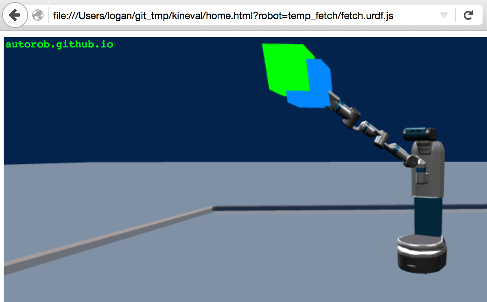

# Assignment 5: Inverse Kinematics

!!! note "Archived project from a previous AutoRob semester"
    This page preserves a project write-up from a past offering of AutoRob (Winter 2023 and
    earlier, using the JavaScript/HTML5 KinEval stencil). It is kept here as a preview of past
    coursework and is **not** an active assignment in the current semester. File paths, due
    dates, and submission mechanics below refer to that earlier offering's KinEval-based
    workflow, not the current Agentic Edition pubsub infrastructure.

**Due 11:59pm, Monday, March 27, 2023**

Although effective, robot choreography in configuration space is super tedious and inefficient. This difficulty is primarily due to posing each joint of the robot at each setpoint. Further, changing one joint often requires updating several other joints due to the nature of kinematic dependencies. Inverse kinematics (IK) offers a much easier and efficient alternative. With IK implemented, we only need to pose the endeffector in a common workspace, and the states of the joints in configuration space are automatically inferred. IK is also important when we care about the "tool tip" of an instrument being used by a robot. One such example is a robot using marker to draw a picture, such as in the PR2 Portrait Bot Project below:

For this assignment, you will now control your robot to reach to a given point in space through inverse kinematics for position control of the robot endeffector. Inverse kinematics will be implemented through gradient descent optimization with both the Jacobian Transpose and Jacobian Pseudoinverse methods, although only one will be invoked at run-time.

As shown in the video below, if successful, your robot will be able to continually place its endeffector (indicated by the blue cube) exactly on the reachable target location (indicated by the green cube), regardless of the robot's specific configuration:

## Features Overview

This assignment requires the following features to be implemented in the corresponding files in your repository:

-   Manipulator Jacobian in "kineval/kineval\_inverse\_kinematics.js"
    
-   Gradient descent with Jacobian transpose in "kineval/kineval\_inverse\_kinematics.js"
    
-   Jacobian pseudoinverse in "kineval/kineval\_matrix.js" (pseudoinverse function) and "kineval/kineval\_inverse\_kinematics.js" (use in gradient descent)
    

Points distributions for these features can be found in the [project rubric section](../policies/grading.md#grading-breakdown). More details about each of these features and the implementation process are given below.

## Matrix Pseudoinverse Function

You will need to implement one additional matrix helper function in "kineval/kineval\_matrix.js" for this assignment: matrix\_pseudoinverse. This method will be necessary for the pseudoinverse version of gradient descent (see below). For this helper function, you are allowed to use a library function for matrix inversion, which can be invoked by using the provided routine numeric.inv(mat), available through [numericjs](https://github.com/sloisel/numeric).

## Core IK Function

The core of this assignment is to complete the kineval.iterateIK() function in the file kineval/kineval\_inverse\_kinematics.js. This function is invoked within the function kineval.inverseKinematics() with three arguments:

-   endeffector\_target\_world: an object expressing the endeffector target in the world frame; it has two fields, endeffector\_target\_world.position, the target endeffector position (as a 3D homogeneous vector), and endeffector\_target\_world.orientation, the target endeffector orientation (as Euler angles)
    
-   endeffector\_joint: the name of the joint directly connected to the endeffector
    
-   endeffector\_position\_local: the location of the endeffector in the local joint frame
    

From these arguments and the current robot configuration, the kineval.iterateIK() function will compute controls for each joint. Upon update of the joints, these controls will move the configuration and endeffector of the robot closer to the target.

**Important:** Students are expected to implement inverse kinematics for **only** the position, not the orientation, of the endeffector.

kineval.iterateIK() should also respect global parameters for using the Jacobian pseudoinverse (through boolean parameter kineval.params.ik\_pseudoinverse) and step length of the IK iteration (through real-valued parameter kineval.params.ik\_steplength). Note that these parameters can be changed through the user interface (under Inverse Kinematics). KinEval also maintains the current endeffector target information in the kineval.params.ik\_target parameter.

IK iterations can be invoked through the user interface (Inverse Kinematics->persist\_ik) or by holding down the 'p' key. Further, the 'r'/'f' keys will move the target location up/down. You can also move the robot relative to the target using the robot base controls. When performing IK iterations, the endeffector and its target pose will be rendered as cube geometries in blue and green, respectively.

For your code to work with the CI grader, you will need to set three global variables in kineval.iterateIK(): robot.dx, robot.jacobian, and robot.dq. There is a comment in "kineval/kineval\_inverse\_kinematics.js" that specifies what each of these variables should hold. Please note that robot.dx and robot.jacobian should both have six rows, even if you are doing position-only IK.

In implementing this IK routine, please also remember the following:

-   Computation of the Jacobian need only to occur with respect to the joints along the chain from the endeffector joint to the robot base
    
-   The location of the endeffector needs to be computed using transforms resulting from the robot's forward kinematics
    
-   The computed velocity in configuration space should be applied to the robot through the .control field of each joint
    

## IK Random Trial

All students in the AutoRob course are expected to run their IK controller with the random trial feature in the KinEval stencil. The IK random trial is executed through the function kineval.randomizeIKtrial() in the file "kineval/kineval\_inverse\_kinematics.js". This function is incomplete in the provided stencil. Code for this function to properly run the random trial will be made available in the assignment 5 discussion channel. Once you have copied the necessary code into this function, you will be able to test your code on random trials by first selecting persist\_ik (under Inverse Kinematics) then selecting execute (under Inverse Kinematics->IK Random Trial) from the user interface.

## Graduate Section Requirement

Students enrolled in the graduate section of AutoRob will implement inverse kinematics for both the position and orientation of the endeffector, namely for the Fetch robot. The default IK behavior will be position-only endeffector control. Both endeffector position and orientation should be controlled when the boolean parameter kineval.params.ik\_orientation\_included is set to true, which can be done through the user interface (Inverse Kinematics->ik\_orientation\_included).

In order to handle the orientation of the endeffector in your IK implementation, you will need to calculate the orientation part of the error term, which will require you to implement a conversion from a rotation matrix to Euler angles. You may find an online reference to inform your implementation of this conversion (please cite it in a comment in your code) or develop your own approach to the conversion calculation. Completing this conversion is a necessary step for including orientation in your IK implementation, and it also fulfills the "Euler angle conversion" feature.

## Optional Extensions

Of the possible optional extension points, one extension point for this assignment can be earned by reaching to 100 targets in a random trial within 60 seconds. A video of this execution must be provided to demonstrate this achievement. This video file should be in the repository root directory with the name "IK100in60" and appropriate file extension.

Of the possible optional extension points, three extension points for this assignment can be earned by implementing the [Cyclic Coordinate Descent (CCD)](http://ieeexplore.ieee.org/document/86079/) inverse kinematics algorithm by Wang and Chen (1991). This function should be implemented in the file "kineval/kineval\_inverse\_kinematics.js" as another option within the function kineval.iterateIK().

Of the possible optional extension points, three extension points for this assignment can be earned by implementing [downhill simplex optimization](https://en.wikipedia.org/wiki/Nelder%E2%80%93Mead_method) to perform inverse kinematics. This function should be implemented in the file "kineval/kineval\_inverse\_kinematics.js" as another option within the function kineval.iterateIK().

Of the possible optional extension points, four extension points for this assignment can be earned by implementing resolved-rate inverse kinematics with null space constraints to respect joint limits. This function should be implemented in the file "kineval/kineval\_inverse\_kinematics.js" as another option within the function kineval.iterateIK().

Of the possible optional extension points, one extension point can be earned by implementing a closed-form inverse kinematics solution for the RexArm 4-DOF robot arm, which can be used later projects in [EECS 467 (Autonomous Robotics Laboratory)](https://www.youtube.com/playlist?list=PLDutmfAv2lfZ9M0XyYfY4N8EwLJhy58G6).

Of the possible optional extension points, four extension points for this assignment can be earned by extending your IK controller to use potential fields to avoid collisions.

Of the possible optional extension points, one extension point for this assignment can be earned by implementing a search mechanism to automatically find appropriate PID gains for the Pendularm. This implementation should be placed in the file "project\_pendularm/pendularm1\_gainsearch.html" and allow for arbitrary initial PID gains for the search to be set in the variable "initial\_gains".

## Project Submission

For turning in your assignment, ensure your completed project code has been committed and pushed to the _master_ branch of your repository.
