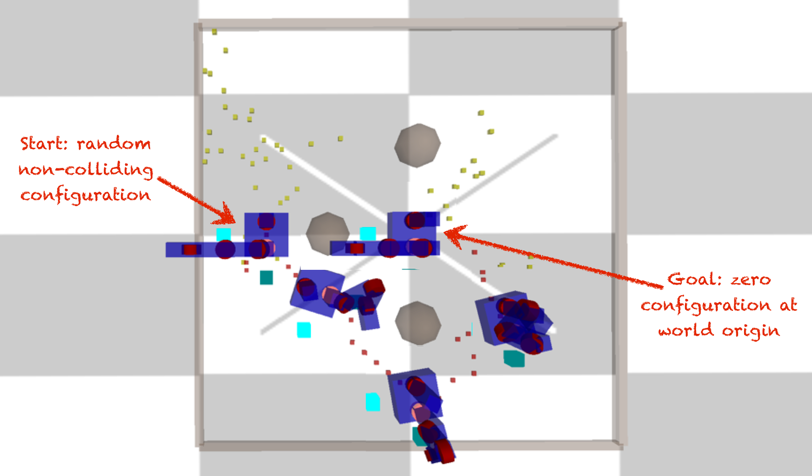
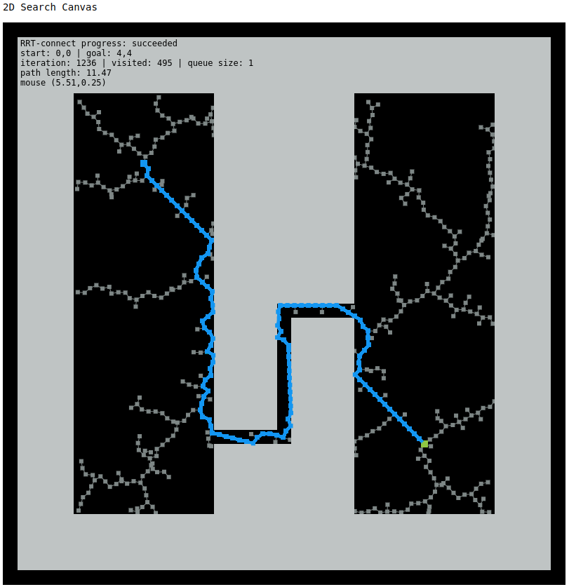
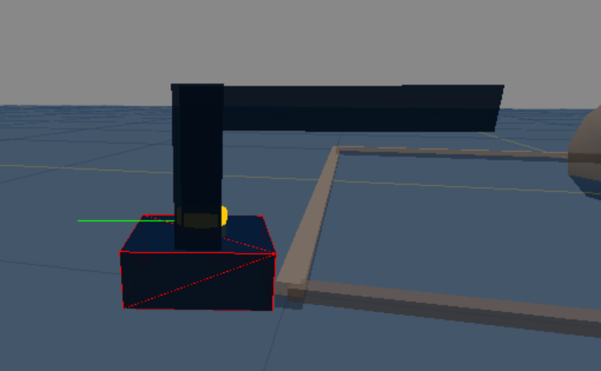
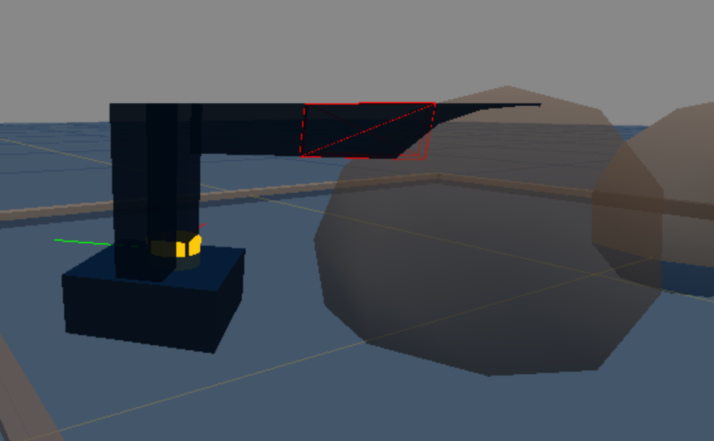
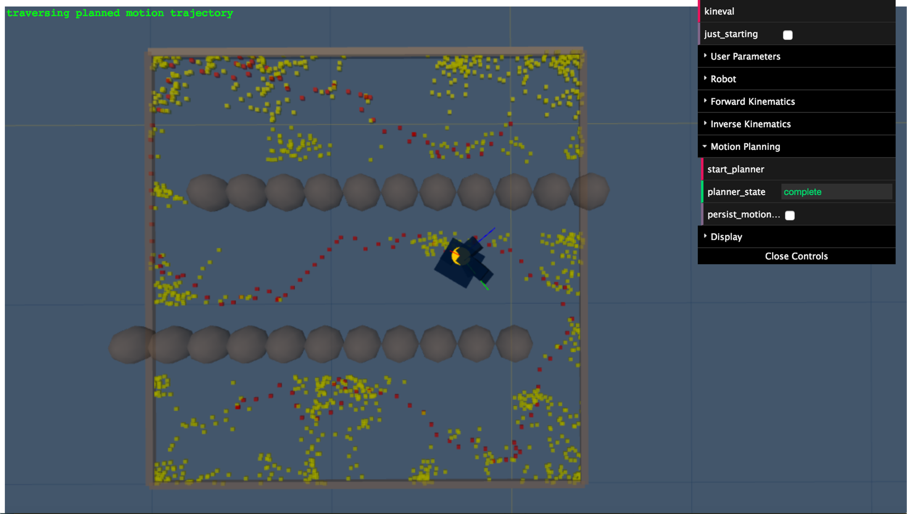

# Assignment 6: Motion Planning

!!! note "Archived project from a previous AutoRob semester"
    This page preserves a project write-up from a past offering of AutoRob (Winter 2023 and
    earlier, using the JavaScript/HTML5 KinEval stencil). It is kept here as a preview of past
    coursework and is **not** an active assignment in the current semester. File paths, due
    dates, and submission mechanics below refer to that earlier offering's KinEval-based
    workflow, not the current Agentic Edition pubsub infrastructure.

**Due 11:59pm, Monday, April 10, 2023**

Our last programming project for AutoRob returns to search algorithms for generating navigation setpoints, but now for a high-dimensional robot arm. The A-star graph search algorithm in Assignment 1 is a good fit for path planning when the space to explore is limited to the two degrees-of-freedom of a robot base. However, as the number of degrees-of-freedom of our robot increases, our search complexity will grow exponentially towards intractability. For such high-dimensional search problems, an exhaustive overview of the majority of the space is not an option. Instead, we now look to sampling-based search algorithms, which will introduce randomness to our search process. These sampling-based algorithms trade off the guarantees and optimality of exhaustive graph search for viably tractable planning in complex environments. The example below shows one example of sampling-based planning navigating to move a rod through a narrow passageway:

and such planning is also used in simple tabletop scenarios:

For this assignment, you will now implement a collision-free motion planner to enable your robot to navigate from a random configuration in the world to its home configuration (or "zero configuration"). This home configuration is where every robot DOF has a zero value. For your planning implementation, the configuration space includes the state of each joint and the global orientation and position of the robot base. Thus, the robot must move to its original state at the origin of the world. A visual explanation of this desired behavior is below:



For both the undergraduate and graduate sections, motion planning will be implemented through the [RRT-Connect algorithm](http://www.cs.cmu.edu/afs/cs/academic/class/15494-s12/readings/kuffner_icra2000.pdf) (described by Kuffner and LaValle). The graduate section will additionally implement the [RRT-Star](http://dspace.mit.edu/openaccess-disseminate/1721.1/63170) (alternate paper [link](https://ieeexplore.ieee.org/stamp/stamp.jsp?arnumber=5980479) via IEEE) motion planner of Karaman et al. (ICRA 2011).

## Features Overview

This assignment requires the following features to be implemented in the corresponding files in your repository:

-   Collision detection in "kineval/kineval\_collision.js"
    
-   2D RRT-Connect in "project\_pathplan/rrt.js"
    
-   Configuration space RRT-Connect in "kineval/kineval\_rrt\_connect.js"
    

Points distributions for these features can be found in the [project rubric section](../policies/grading.md#grading-breakdown). More details about each of these features and the implementation process are given below.

## 2D RRT-Connect

To gain familiarity with the RRT-Connect algorithm, you can start this assignment by returning to the 2D world from Assignment 1. If needed, refer back to the Assignment 1 description for a description of the search canvas environment and its parameters. You can enable RRT-Connect as the search algorithm through the URL parameter search\_alg: "search\_canvas.html?search\_alg=RRT-connect".

You will implement the 2D version of RRT-Connect in project\_pathplan/rrt.js by completing the iterateRRTConnect() function. Its signature and desired return values are provided in the code stencil. Note that there are other function stencils provided in this file as well, but your 2D RRT-Connect implementation should involve only iterateRRTConnect() and any helper functions you choose to add. You do **not** need to implement iterateRRT(), and only students in the graduate section need to implement iterateRRTStar() (see description of graduate section requirements below).

A few other details to be aware of when implementing 2D RRT-Connect:

-   The two search tree global variables needed for RRT-Connect, T\_a and T\_b, are initialized for you in project\_pathplan/infrastructure.js
    
-   You can use provided support functions from project\_pathplan/infrastructure.js, including two new RRT-specific helpers: insertTreeVertex() and insertTreeEdge()
    
-   You may also create additional helper functions in project\_pathplan/rrt.js to handle different steps of the RRT-Connect algorithm; some suggestions are provided in the code stencil
    
-   iterateRRTConnect() is called for you from the animation code, and it should perform just one iteration of the RRT-Connect algorithm each time it is called
    
-   You should use drawHighlightedPath(), **not** drawHighlightedPathGraph(), to visualize the final path found by RRT-Connect; see the implementation in draw.js for information about how this function works
    

If properly implemented, your RRT-Connect implementation should produce results similar to the image below, although the inherent randomness of the algorithm will mean that the sampled states and final path will be slightly different:



## Getting Started in Configuration Space

The core of this assignment is to complete the robot\_rrt\_planner\_init() and robot\_rrt\_planner\_iterate() in kineval/kineval\_rrt\_connect.js. This file and the collision detection file kineval/kineval\_collision.js have already been included in home.html for you:

```

    <script src="kineval/kineval_rrt_connect.js"></script>
    <script src="kineval/kineval_collision.js"></script>
```

The code stencil will automatically load a default world. A different world can be specified as an appended parameter within the URL: "home.html?world=worlds/world\_name.js". The world file specifies the global objects "robot\_boundary", which describes the min and max values of the world along the X, Y, and Z axes, and "robot\_obstacles", which contains the locations and radii of sphere obstacles. To ensure the world is rendered in the display and available for collision detection, the geometries of the world are included through the provided call to kineval.initWorldPlanningScene() in kineval/kineval.js.

## Collision Detection Setup

In the search canvas world, a collision detection function was provided for you. For RRT-Connect in robot configuration space, you will need to start by completing the collision detection feature yourself. The main collision detection function used by configuration-space RRT-Connect is kineval.robotIsCollision() (in kineval/kineval\_collision.js), which detects robot-world collisions with respect to a specified world geometry.

Worlds are specified as a rectangular boundary and sphere obstacles. A collection of worlds are provided in the "worlds/" subdirectory of kineval\_stencil. The collision detection system performs two forms of tests: 1) testing of the base position of the robot against the rectangular extents of the world, which is provided by default, and 2) testing of link geometries for a robot configuration against spherical objects, which depends on code you will write.

Collision testing for links in a configuration should be performed by AABB/Sphere tests that require the bounding box of each link's geometry in the coordinates of that link. This bounding box is computed for you by the following code within the loop inside kineval.initRobotLinksGeoms() in kineval.js:

```

    // For collision detection,
    // set the bounding box of robot link in local link coordinates
    robot.links[x].bbox = new THREE.Box3;
    // setFromObject returns world space bbox
    robot.links[x].bbox = robot.links[x].bbox.setFromObject(robot.links[x].geom);
  
```

As you write the collision test, you can thus access the AABB for any robot link as robot.links\[x\].bbox. This object contains two elements, max and min, that contain the maximum and minimum corners of the link's bounding box, specified in the link's local coordinate frame.

Even before your planner is implemented, you can use the collision system interactively with your robot. The provided kineval.robotIsCollision() function is called for you during each iteration from my\_animate() in home.html:

```

    // determine if robot is currently in collision with world
    kineval.robotIsCollision();
```

## Completing Collision Detection

To complete the collision system, you will need to modify the forward kinematics calls in kineval/kineval\_collision.js. Specifically, you will need to perform a traversal of the forward kinematics of the robot for an arbitrary robot configuration within the function kineval.poseIsCollision(). kineval.poseIsCollision() takes in a vector in the robot's configuration space and returns either a boolean false for no detected collision or a string with the name of a link that is in collision. As a default, this function performs base collision detection against the extents of the world. For collision detection of each link, this function will make a call to function that you create called robot\_collision\_forward\_kinematics() to recursively test for collisions along each link. Your collision FK recursion should use the link collision function, traverse\_collision\_forward\_kinematics\_link(), which is provided in kineval/kineval\_collision.js, along with a joint traversal function that properly positions the link and joint frames for the given configuration.

Some pointers about your collision FK traversal:

-   Remember that you need the inverse of the matrix stack for collision testing in a link frame (instead of in the world frame)
    
-   You can feel free to implement matrix\_invert\_affine() instead of using numeric.inv(). Affine transforms can be inverted (in constant time, Quiz 3!) through a much simpler process than the generic matrix inversion, which is O(n^3) for Gaussian elimination.
    

If successful to this point, you should be able to move the robot around the world and see the colliding link display a red wireframe when a collision occurs. There could be many links in collision, but only one will be highlighted, as shown in the following examples:

 

## Implementing and Invoking the Planner

Your motion planner will be implemented in the file kineval/kineval\_rrt\_connect.js through the functions kineval.robotRRTPlannerInit() and robot\_rrt\_planner\_iterate(). This implementation can be a port of your 2D RRT-Connect, but it will require some updates to work with in the configuration space of KinEval robots. The kineval.robotRRTPlannerInit() function should be modified to initialize the RRT trees and other necessary variables. The robot\_rrt\_planner\_iterate() function should be modified to perform a **single** RRT-Connect iteration based on the current RRT trees.

Basic RRT tree support functions are provided for initialization, adding configuration vertices (which renders "breadcrumb" indicators of base positions explored), and adding graph edges between configuration vertices. This function should **not** use a for loop to perform multiple planning iterations, as this will cause the browser to block and become unresponsive. Instead, the planner will be continually called asynchronously by the code stencil until a motion plan solution is found.

**Important:** Your planner should be constrained such that the search does not consider configurations where the base is outside the X-Z plane. Specifically, the base should not translate along the Y axis, and should not rotate about the X and Z axes.

Once implemented, your planner will be invoked interactively by first moving the robot to an arbitrary non-colliding configuration in the world and then pressing the "m" key. The "m" key will request the generation of a motion plan. The goal of a motion plan will always be the home configuration, as defined in the introduction to this assignment. While the planner is working, it will not accept new planning requests. Thus, you can move the robot around while the planner is executing.

## Planner Output

The output of your planner will be a motion path in a sequentially ordered array (named kineval.motion\_plan\[\]) of RRT vertices. Each element of this array contains a reference to an RRT vertex with a robot configuration (.vertex), an array of edges (.edges), and a threejs indicator geometry (.geom). Once a viable motion plan is found, this path can be highlighted by changing the color of the RRT vertex "breadcrumb" geom indicators. The color of any configuration breadcrumb indicator in a tree can be modified, such as in the following example for red:

```

  tree.vertices[i].geom.material.color = {r:1,g:0,b:0};
```

The user should should be able to interactively move the robot through the found plan. Stencil code in user\_input() within kineval\_userinput.js will enable the "n" and "b" keys to move the robot to the next and previous configuration in the found path, respectively. These user key presses will respectively increment and decrement the parameter kineval.motion\_plan\_traversal\_index such that the robot's current configuration will become:

```

  kineval.motion_plan[kineval.motion_plan_traversal_index]
```

**Note:** we are **NOT** using robot.joints\[...\].control to execute the found path of the robot. Although this can be done, the collision system does not currently test for configurations that occur due to the motion between configurations.

The result of your RRT-Connect implementation in configuration space should look similar to this path found in the worlds/world\_s.js world:



## Testing

Make sure to test all provided robot descriptions from a reasonable set of initial configurations within all of the provided worlds, ensuring that:

-   a valid non-colliding path is found and can be traversed,
    
-   the robot does not to take steps longer than 1 unit,
    
-   the robot base does not move outside the X-Z plane. Specifically, the base should not translate along the Y axis, and should not rotate about the X and Z axes.
    

## Warning: Respect Configuration Space

The planner should produce a collision-free path in configuration space (over all robot DOFs) and not just the movement of the base on the ground plane. If your planner does not work in configuration space, it is sure to fail tests used for grading.

## Graduate Section Requirement

In addition to the requirements above, students in the graduate section must also implement the [RRT-Star](http://dspace.mit.edu/openaccess-disseminate/1721.1/63170) motion planning algorithm for the 2D search canvas. You will need to complete the iterateRRTStar() function stencil in project\_pathplan/rrt.js for this feature. Part of this assignment is an exercise in how to conceptualize implementation details of an algorithm from a robotics paper. Because of this, you will need to refer to the linked paper for details on how to implement the RRT-Star algorithm. **Note:** The course staff will not provide assistance with RRT-Star, so we strongly encourage high-level discussion of the algorithm among students on the assignment channel and amongst peers.

## Advanced Extensions

Of the possible advanced extension points, one additional point for this assignment can be earned by adding the capability of motion planning to an arbitrary robot configuration goal.

Of the possible advanced extension points, two additional points for this assignment can be earned by using the A-star algorithm for base path planning in combination with RRT-Connect for arm motion planning.

Of the possible advanced extension points, one additional point for this assignment can be earned by writing a collision detection system for two arbitrary triangles in 2D using a JavaScript/HTML5 canvas element.

Of the possible advanced extension points, two additional points for this assignment can be earned by writing a collision detection system for two arbitrary triangles in 3D using JavaScript/HTML5 and threejs or a canvas element.

Of the possible advanced extension points, four additional points for this assignment can be earned by implementation of triangle-triangle tests for collision detection between robot and planning scene meshes.

Of the possible advanced extension points, three additional points for this assignment can be earned by implementation of cubic or quintic polynomial interpolation (Spong Ch. 5.5.1 and 5.5.2) across configurations returned in a computed motion plan.

Of the possible advanced extension points, four additional points for this assignment can be earned by implementing an approved research paper describing a motion planning algorithm.

## Project Submission

For turning in your assignment, ensure your completed project code has been committed and pushed to the _master_ branch of your repository.
