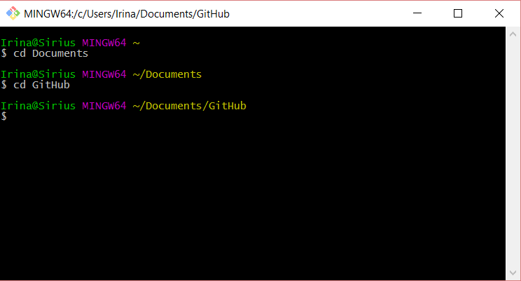
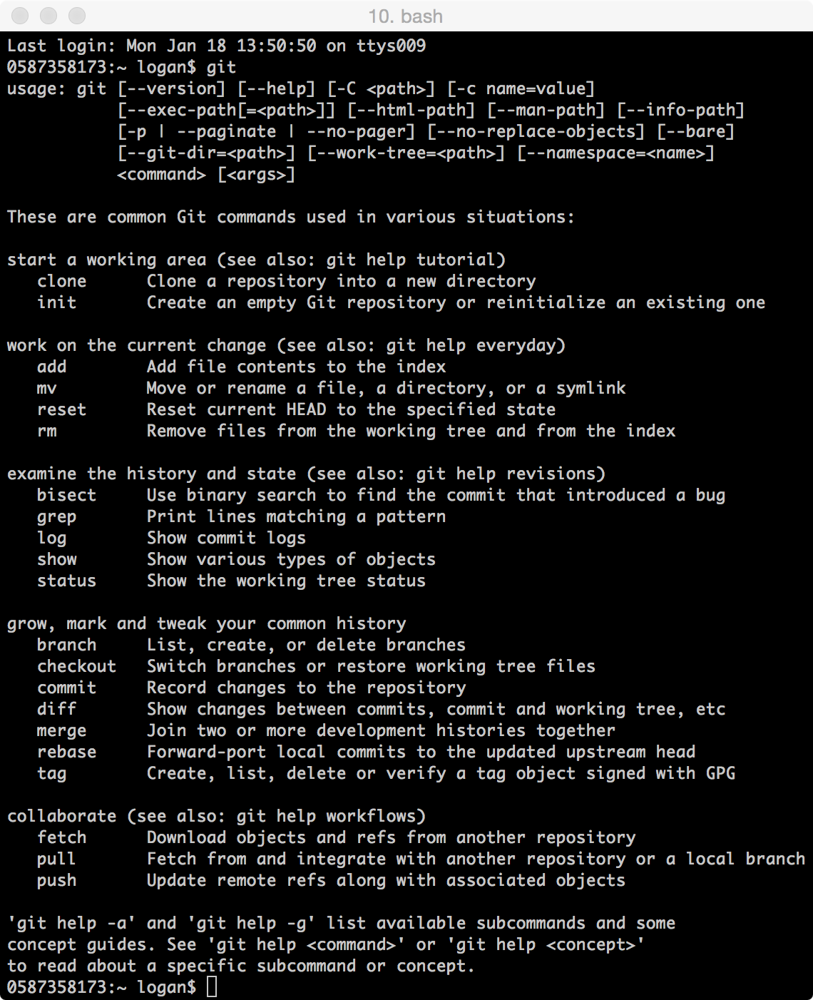
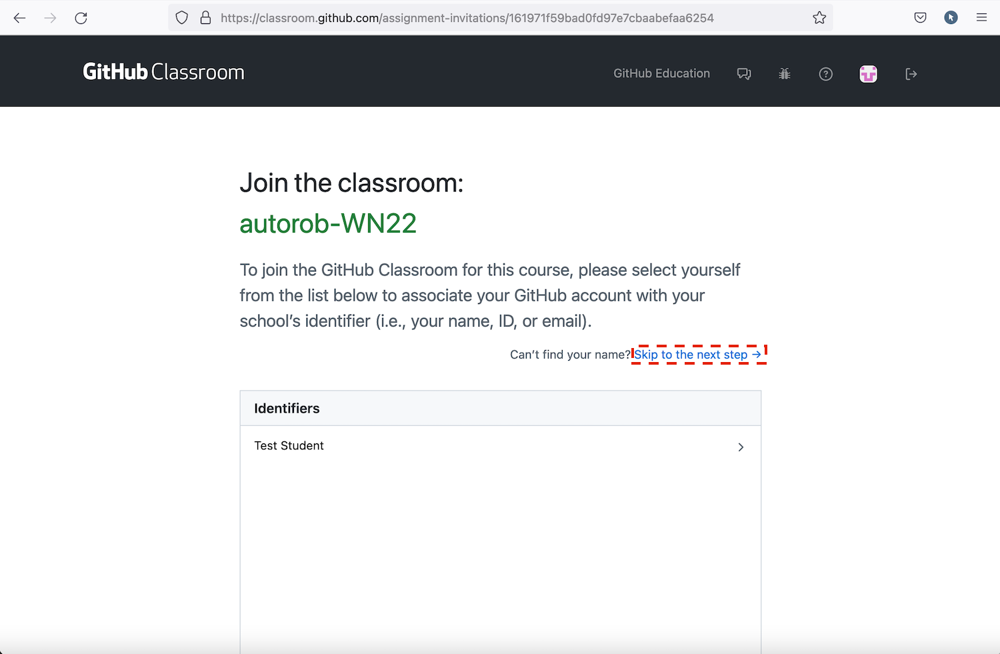
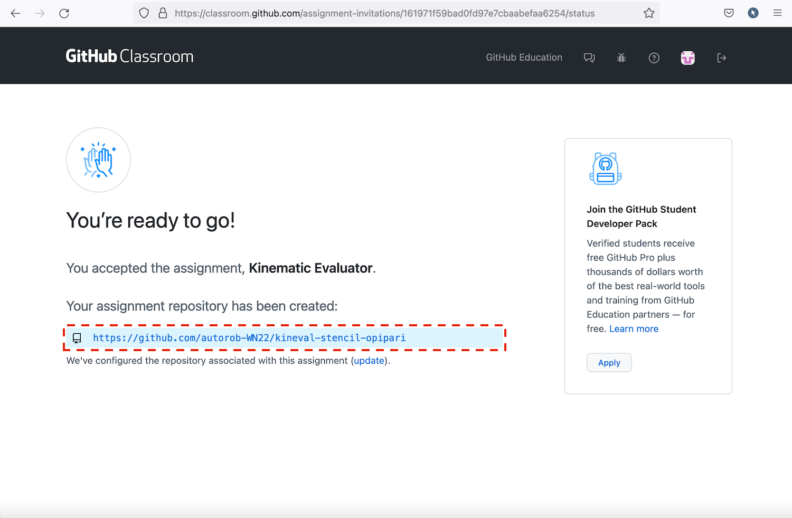
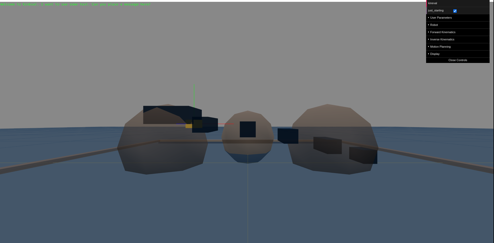

# Git-ing Started with Git

Each student in this class is responsible for providing a git repository for submitting their project work and receiving grading feedback. Use of the GitHub classroom is available as a complementary service that provides repositories free for student use. If a student is uncomfortable using the GitHub service, the [EECS GitLab Server](https://gitlab.umich.edu/) is a service within the University of Michigan and is available for creation of student repositories.

Using version control effectively is an essential skill for both the AutoRob course and, more generally, contributing to advanced projects in robotics research and development. Git is arguably the most widely used version control system at the current time. Examples of the many robotics projects using Git include: [Lightweight Communications and Marshalling](https://github.com/lcm-proj), [the Robot Operating System](https://github.com/ros), [Robot Web Tools](https://github.com/RobotWebTools), [Fetch Robotics](https://github.com/fetchrobotics), and [the Rethink Baxter](https://github.com/RethinkRobotics). To help you use Git effectively, the course staff has added the tutorials below for getting started with Git. This is meant to be a starting guide to using Git version control and the bash command shell. For a more complete list of commands and features of Git, you can refer to the following guides: [The Git Pro book](http://git-scm.com/book/en/v2/Getting-Started-Installing-Git) or The [Basic Git command line reference for windows users](http://johnatten.com/2012/09/08/basic-git-command-line-reference-for-windows-users/). An interactive tutorial for Git is available at [LearnGitBranching](http://learngitbranching.js.org/).

### Installing Git

The AutoRob course assumes Git is used from a command line terminal to work with the a Git hosting service, such as [GitHub](https://github.com), [Bitbucket](https://bitbucket.com), or [EECS GitLab](https://gitlab.eecs.umich.edu/). Such terminal environments are readily available in Linux and Mac OSX through their respective terminal programs. For MS Windows, we recommend Git Bash, which can be downloaded from the [Git for Windows](https://gitforwindows.org/) project. Several other viable alternatives Git clients exist, such as the GUI-based [GitKraken](https://www.gitkraken.com/).

Git can be installed on Linux through the package managment system used by your Linux distro, likely with one of the following commands:

```

    sudo yum install git-all
```

```

    sudo apt install git
```

For Mac OSX, Git can be installed on its own using the [Git-OSX-Installer](https://sourceforge.net/projects/git-osx-installer/) or as part of larger set of [Xcode](https://en.wikipedia.org/wiki/Xcode) build tools.

If you open the "Git Bash" program on Windows or the "Terminal" program on Mac OSX or Linux, you should see a shell environment that looks something like this (screenshot from an older version of Windows Git Bash):



If you have Git installed, you should should be able to enter the "git" command and see the following usage information printed (screenshot from OSX):



### GitHub Classroom

If you choose to use GitHub for hosting your repository, the course staff has created a GitHub classroom which students can choose to use for setting up their repository. If a student is uncomfortable using the GitHub service, the [EECS GitLab Server](https://gitlab.umich.edu/) is a service within the University of Michigan and is available for creation of student repositories.

Once you have configured Git with your local development environment, you should then be able to join the autorob-WN22 GitHub classroom by following the instructions at this [invitation link](https://classroom.github.com/a/0ieHZNvR). This link should take you to the following page:



By clicking on 'Skip to the next step', shown above, you will be able to accept the invitation. After accepting, you will be enrolled in the autorob-WN23 classroom and a private clone of the [KinEval stencil repository](https://github.com/lizolson/kineval-stencil) will be created for you to use. Your private repository will automatically be named `kineval-stencil-<username>`. After accepting, you should see a page similar to the one below:



**If you have any issues or questions about setting up your repository, contact the course staff through slack or email for help.**

### Cloning your repository

The most common thing that you will need to do is pull and push files from and to your Git hosting service. Upon opening Git Bash or the terminal, you will need to go to the location of **both** your GitHub/Bitbucket/GitLab repository on the web and your Git workspace on your local computer. Our first main step is to clone your remote repository onto your local computer. Towards this end, the next step is to determine your current directory, assuming you will use this directory to create a workspace. For Linux and OSX, the terminal should start in your home directory, often "/home/username" or "/Users/username". For Git Bash on Windows, the default home directory location could be the Documents in your user directory, or the general user folder within "C:\\Users".

From your current directory, you can use Bash commands to view and modify the contents of directories and files. You can see a list of the files and folders that can be accessed using ls (list) and change the folder using the command cd (change directory) as shown below. If you believe that the directory has files in addition to folders, but would like a list of just the folders, then the command ls –d \*/ can be used instead of ls. Below is a quick summary of relevant Bash commands (or reference the [cheat sheet here](https://files.fosswire.com/2007/08/fwunixref.pdf)):

-   "ls" prints a listing of files in the current directory
-   "pwd" prints the location of the current directory in the filesystem
-   "cd \[FolderName\]" moves the terminal to a new directory in the filesystem
-   "ls \[Expression\]" prints a listing of files in the current directory matching the given Expression; ls r\* prints all files starting with the character 'r'
-   "mkdir \[FolderName\]" creates a folder within the current directory. If the folder name has spaces, then NameFolder will need to be in double quotes.
-   "rmdir \[FolderName\]" removes a specified empty folder. If it is not empty, the folder will not be removed.
-   "rm –rf \[FolderName\]" removes a specified folder and all the contents
-   "touch \[FileName\]" creates a single empty text file. Note: file names cannot have spaces!
-   "touch \[FIleName1.txt\] \[FileName2.txt\]..." creates multiple empty text files
-   "rm \[FileName\]" removes a specific file from the current directory
-   "rm –i \[FileName\]" confirmation prompt required before removing file from current directory.
-   "rm –v \[FileName\]" removes the file and reports in console

Once you have navigated to the directory where you want to create your workspace, you are ready to clone a copy of your remote repository and populate it with files for AutoRob projects. It assumed that you have already created a repository on your Git hosting service, given the course staff access to this repository, and provided a link of your repository to the course staff. You will need the repository link in the form of "https://github.com/autorob-WN23/kineval-stencil-<username>" if you are using HTTPS (default) or "git@github.com:autorob-WN22/kineval-stencil-<username>.git" if you are using SSH (only if you have set up your SSH keys). You'll use this link to clone a copy of your remote repository onto your local machine using the following git command below. This command will clone the repository contents to a subdirectory labeled with the name of the repository:

```

    git clone [repository URL link]
```

This directory should be listed and inspected to ensure it has been cloned with the contents of the repository, matching the remote repository from your Git hosting service. If this is a new repository, it is not problem for this directory to be empty:

```

    ls [repository_name]
```

After cloning has finished, you can also check for differences between the files on your computer and the remote repository by running the "git status" command in from within your newly-created directory as shown below. If you receive the message shown in the example below, then there are no differences. If there are differences, then it will have the number of files which are different highlighted in red.

```

    $ git status
    On branch master
    Your branch is up-to-date with 'origin/master'.
    nothing to commit, working directory clean
```

### Important: workspace is not the same as repository

You should now have a local copy of your repository. It is critical to note that your local repository is different than your current workspace. Your workspace is not automatically tracked by the version control system and considered ephemeral. Any changes made to your workspace must be committed into the local repository to be recognized by the version control system. Further, any changes committed to your local repository must also be pushed remotely to be recognized by your Git hosting service. Thus, any changes made to your workspace can be lost if not committed and pushed, which will be discussed more in later sections.

### Testing out the stencil code

Your folder should now be populated with the KinEval files. Open "home.html" in a web browser and ensure you see the starting point page pictured below:



If your browser throws an error when loading "home.html", one potential cause is that this browser disallows loading of local files. In such cases, the browser will typically report a security error in the console. This security issue is avoided by serving the KinEval files from an HTTP server. Such a HTTP server is commonly available within distributions for modern operating systems. Assuming Python is installed on your computer, you can start a HTTP with the following command from your workspace directory, and then view the page at [localhost:8000](http://localhost:8000/home.html):

```

    python -m SimpleHTTPServer
```

Alternatively, if you have nodejs installed, you can install and start a HTTP with the following command from your workspace directory, and then view the page at [localhost:3000](http://localhost:3000/home.html):

```

    npm install simple-server
    node simple-server
```

### Commit and push to update your repository

Whenever you make any significant changes to your repository, these changes should be committed to your local repository and pushed to your remote repository. Such changes can involve adding new files or modifying existing files in your local workspace. For such changes, you will first commit changes from your workspace to your local repository using the "git add" then "git commit" commands:

```

    git add [FileName]
    git commit -m "message describing changes"
```

and then pushing these changes from your local repository to a synced repository on your git hosting service:

```

    git push
```

This commit will occur to the "master" branch of your repository.

Note: the change files must be located in the correct repository folder on your local computer and these commands should be performed in the local workspace directory. Below is a more detailed summary of git commands for adding files from your workspace to your repository:

-   "git add" adds changed files to the next commit. There are several different options which can follow this command.
-   "git add –A" adds all new files and changes to the next commit including deletions (not recommended)
-   "git add –u" adds all changes to the next commit without new files
-   "git add \[FileName\]" add all changes to a specific file to the next commit
-   "git commit" commits files that have been staged with a "git add" command. A commit message (specified with "-m") is required and is good practice to list changes that you have made.
-   "git commit –m "Message"" commits all files staged with "git add"
-   "git push" pushes the committed changes to remote repository

Note: If you are unsure about the options to use with these commands or any other git command, "-h" is your friend. Try the following commands:

```

    git add -h
    git commit -h
    git push -h
```

Once you have committed and pushed, your changes have been safely stored and tracked remotely. The local workspace _could_ now be deleted without concern. This local workspace can also be updated with changes to the remote repository by pulling.

### Pulling remote changes

Changes can be made to your remote repository, potentially by other collaborators, without being continuously tracked by your local repository. This can lead to potential versioning conflicts when committed changes contradict each other. For the AutoRob course, versioning conflicts should not be a problem because commits to your repository, other than those from the course staff, should be yours alone. That said, one good practice is to ensure your workspace, local repository, and remote repository are synced before making any changes. A brute force method for doing this is to re-clone your repository each time you begin to make changes. Another option is to pull remote changes into your local repository and workspace using the git pull command:

```

    cd [repository_name]
    git pull
```

Below is a more detailed summary of git commands for pulling and fetching:

-   "git pull \[RemoteName\]" is used for retrieving commits and merging the files into what is already in the local workspace. This may make changes to the files that are already there; effectively, this is a fetch followed by a merge. You do not need the \[RemoteName\] parameter if you are pulling from your default remote
-   "git fetch \[RemoteName\]" is used for retrieving commits from a remote repository _without_ merging them into the workspace. This creates a copy of the updates in your local repository but does not apply them to the workspace.

### Branching

Branching is an effective mechanism for work in a repository to be done in parallel with changes merged at a later point. A branch essentially creates a copy of your work at a particular version. Branches are independently tracked by the version controller and can be merged together when requested (which can result in a "pull request" when you're working on a repository in collaboration with others). The larger story for branching and merging is outside the scope of AutoRob.

The working version of your code, which you submit for grading, is expected to be in the _master_ branch of your repository. When working on a new assignment, it is recommend that you create a branch for this new work. This allows your stable code in the _master_ branch to be undisturbed while you continue to modify your code. Once your work for this assignment is done, you can then update your _master_ by merging in your assignment branch. Stylistically, it is helpful to use a branch name like _Assignment-X_ for your assignment branch for project number _X_.

The simplest means for branching in this context is to use the branching feature from the webpage of your remote repository. From GitHub, simply select the master branch from the "Branch: " button and enter the name of the branch to be created. From Bitbucket, select the "Branches" icon from the left hand toolbar and follow the instructions for branch creation. If successful, you should see a list of branches that can each be inspected for their respective contents. Branches can also be deleted from this interface. You will need to pull from your remote repository after creating any branches from this interface to see them in your local repository.

A branch can also be created from the command line by the following, which will create a copy of the current branch:

```

    git branch [branch_name]
```

You can switch between branches with the following command:

```

    git checkout [branch_name]
```

as well as clone a specific branch from a repository:

```

    git clone -b [branch_name] [repository URL link]
```

Good luck and happy hacking!
