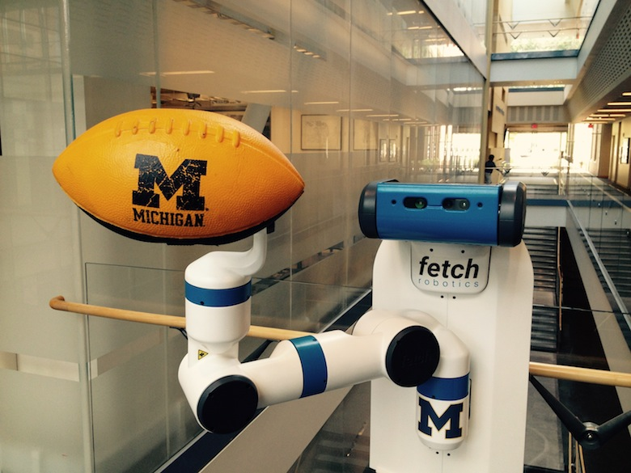

# AutoRob — Agentic Edition

**Robotics 380 · EECS 367 — Introduction to Autonomous Robotics** 
**Robotics 511 — Mobile Manipulation Systems**
**Fall 2026 · University of Michigan**

!!! info "An experimental offering: Agentic Edition"
    AutoRob this semester uses an experimental new format suited to AI-enabled code
    development and its application to autonomous robotics. With allowed use of AI tools,
    students direct AI tools to build their own robot operating system (a publish-subscribe
    messaging system supporting the *rosbridge* protocol), then use AI tools to implement
    course concepts — A* search, physical simulation, forward/inverse kinematics, motion
    planning — as nodes on that system. The course follows an **"Agenticate, Mutate, Test"**
    structure: students may use AI tools for coding projects (**Agenticate**), must be able to
    repair mutation-tested versions of their own submitted code without AI assistance
    (**Mutate**), and are assessed via quizzes and exams (**Test**). See the full
    [learning objectives](policies/learning-objectives.md) for details.

## Quick Links

### Course Website

[autorob.org](https://autorob.org)

### Course Missive

[Course Missive (Google Doc)](https://docs.google.com/document/d/1fCXTPp7eN2-lJC9CPQFw6BScGBrJ7MihgANYnXIzZjU/edit?usp=sharing)

### Course Schedule

[Course Schedule (Google Sheet)](https://docs.google.com/spreadsheets/d/175IDKFZSJLymJ2ZCRzDd2OYY6ukzRo4DM9KIuaQrtJ0/edit?usp=sharing) · [on this site](schedule.md)

### Course Discussion Board (Piazza)

[piazza.com/class/mtdbrfvg77k78l](https://piazza.com/class/mtdbrfvg77k78l)

### Course Autograder

*(link to be provided by course staff)*

### Course Google Drive

[Course Google Drive](https://drive.google.com/drive/folders/1r27BzMQNN_h4YBWMJ6AmJpnE1iJZg1WQ?usp=drive_link)

## Introduction

AutoRob is an introduction to the computational foundations of autonomous robotics for programming modern mobile manipulation systems. AutoRob covers fundamental concepts in autonomous robotics for the kinematic modeling of arbitrary open-chain articulated robots and algorithmic reasoning for autonomous path and motion planning, with brief coverage of dynamics and motion control. These core concepts are contextualized through their instantiation in modern robot operating systems, such as ROS and LCM. The AutoRob [learning objectives](policies/learning-objectives.md) are geared to ensure students completing the course are fluent programmers capable of computational thought and can develop full-stack mobile manipulation software systems.

The AutoRob course can be thought of as an exploration into the foundation for reasoning and computation by autonomous robots capable of mobility and dexterity — given a robot as a machine with sensing, actuation, and computation, how do we build computational models, algorithms, and software implementations that allow the robot to function autonomously, especially for pick-and-place tasks? Computationally, these functions form the basis of the **sense-plan-act** paradigm that defines the discipline of robotics as the study of [embodied intelligence](https://dspace.mit.edu/bitstream/handle/1721.1/6569/AIM-1293.pdf), as introduced by [Brooks](https://rodneybrooks.com). Embodied intelligence allows for understanding and extending concepts essential for modern robotics, especially mobile manipulators such as the Fetch robot and Digit humanoid.

In AutoRob, coding is believing. AutoRob is a computing-friendly pathway into robotics, providing broad exposure to the foundations of autonomous robotics without addressing the whole of robotics. The scope of AutoRob is introductory kinematic modeling and planning-based reasoning, as well as dynamics and control.

With allowed use of AI tools (available to U-M students via [genai.umich.edu](https://genai.umich.edu)), AutoRob projects ground course concepts through student implementation of kinematics and planning algorithms in the student's own robot operating system. Students direct AI tools to build a publish-subscribe messaging system supporting the *rosbridge* protocol, then use AI tools for project implementations covering: graph search path planning ([A\* algorithm](https://en.wikipedia.org/wiki/A*_search_algorithm)), basic physical simulation ([Lagrangian dynamics](https://en.wikipedia.org/wiki/Classical_mechanics), [numerical integrators](https://en.wikipedia.org/wiki/Numerical_integration)), PID control, forward kinematics (3D geometric [matrix transforms](https://en.wikipedia.org/wiki/Transformation_matrix), quaternion axis-angle rotation), JSON and URDF parsing, inverse kinematics ([gradient descent](https://en.wikipedia.org/wiki/Gradient_descent) optimization, geometric [Jacobian](https://en.wikipedia.org/wiki/Jacobian_matrix_and_determinant)), and motion planning ([RRT-Connect](https://en.wikipedia.org/wiki/Rapidly-exploring_random_tree), collision detection), as well as 3D rigid body simulation in maximal coordinates. See [Project 1](projects/project1/index.md) for how this is scaffolded.

The KinEval code stencil in JavaScript/HTML5, used for previous offerings of AutoRob since 2014, continues to support manual coding demonstrations of course-related topics. Whether built with KinEval or the Agentic Edition's own pubsub stack, your code is designed to work with any robot that supports the *rosbridge* protocol, including any robot running ROS.

### Concepts to build your own robot operating system

AutoRob aims to provide a general conceptual framework that enables students to build their own robot operating systems. Like computing [operating systems](https://www.merriam-webster.com/dictionary/operating%20system), the fundamental goal of a robot operating system is to bridge the gap between robot hardware and application programs to control the robot purposefully. Robot operating systems hide the gory details of managing robot devices, software processes, and (especially) low-level sensorimotor routines. This abstraction provides a platform for robot applications to run seamlessly across a wide variety of robots with different physical and electronic configurations.

The area of robot operating systems has emerged from pioneering work in [robot middleware](https://en.wikipedia.org/wiki/Robotics_middleware) systems over the last 20 years. AutoRob draws from historically significant and modern robot operating systems, including Lightweight Communications and Marshalling (LCM), Yet Another Robot Platform (YARP), the MOOS, JAUS-based systems, Player/Stage, and the well-branded [Robot Operating System (ROS)](http://ros.org). Topics covered in AutoRob will help you understand the insides of all of these robot middleware systems, make them better, and develop the robot operating systems of the future.

## Prerequisite and Related Courses

### Enforced Undergraduate Prerequisites

The following are prerequisite courses that must be completed, or granted permission by the course instructor, before attempting ROB 380, EECS 367, or ROB 511:

**Programming proficiency** (one of): EECS 281 (Data Structures and Algorithms), EECS 402 (Programming for Scientists and Engineers), ROB 502 (Programming for Robotics), ROB 550 (Robotic Systems Laboratory)

**Mathematical proficiency** (one of): ROB 101 (Computational Linear Algebra), Math 214 (Applied Linear Algebra), Math 217 (Linear Algebra), Math 417 (Matrix Algebra I), Math 419 (Linear Spaces and Matrix Theory)

### Advisory and Recommended Prerequisites

- **Calculus** — strongly recommended: Math 116 (Calculus II); advisory: Math 216 (Differential Equations)
- **Artificial Intelligence** topics — Computer Graphics, Computer Vision (EECS 442), Artificial Intelligence (EECS 492), Machine Learning (EECS 445)
- **Robotics** — advisory: ROB 330 (Localization, Mapping, and Navigation)

### ROB 380 or ROB 320? Which should I take?

Robotics Majors are highly recommended to take Robotics 320 (OperRob) instead of AutoRob. Both OperRob and AutoRob emphasize understanding and building general kinematics and planning software stacks, with interfaces to work with a diversity of real mobile manipulation robots. AutoRob aims to provide broad exposure to autonomous robotics as a single course in simulation, as an upper-level CS (ULCS) elective. OperRob is focused on the needs of Robotics Majors for computational thought and systems programming, in the context of a larger robotics degree program.

### Credit Exclusions

ROB 320, ROB 380, EECS 367, and ROB 511 have an academic credit exclusion — academic credit can only be granted for one of these courses.

### Related and Further Courses

AutoRob is a computing-friendly pathway into robotics, well-suited as preparation for a Major Design Experience such as EECS 467 (Autonomous Robotics Laboratory), and complemented by ROB 550 (Robotics Systems Laboratory) for more extensive hands-on experience with real robotic platforms. AutoRob complements courses covering computational perception (Robotics 330, EECS 467, ROB 530/EECS 568 Mobile Robotics, EECS 442 Computer Vision) and deep learning (ROB 430 DeepRob, ROB 498 topics, EECS 498 Deep Learning for Computer Vision). AutoRob is complementary to artificial intelligence courses (EECS 492, EECS 445, EECS 595) and pairs well with embedded systems courses (EECS 373, EECS 473) and sensorimotor control (EECS 460, EECS 461, ME 461). AutoRob is a computation-focused alternative to ME 567/ROB 510 (Robot Kinematics and Dynamics), and an excellent precursor to algorithmic robotics (EECS 498) and advanced motion planning (EECS 598).

## Discussion Services: Piazza

The AutoRob Piazza workspace hosted by Michigan ITS will be used for optional course-related question-and-answer discussions *(workspace link to be provided by course staff)*. [Piazza](https://piazza.com) is a cloud-hosted, web-accessible online discussion forum system and is FERPA compliant.

Actively engaging in course discussions is a great way to become a better roboticist.

## Homework: PrairieLearn

Homework and review questions are administered through [PrairieLearn](https://www.prairielearn.com/) *(course instance link to be provided by course staff)*.

## Textbooks

AutoRob is compatible with both the Spong et al. and Corke textbooks (listed below), although only one is needed. Spong et al. is the required textbook, supplemented with additional handouts. The Corke textbook provides broader coverage with an emphasis on intuitive explanation. The Lynch and Park textbook is not officially supported this semester but is a useful alternative perspective on robot kinematics.

[**Robot Modeling and Control**](http://bcs.wiley.com/he-bcs/Books?action=index&itemId=0471649902&bcsId=2888)
Mark W. Spong, Seth Hutchinson, and M. Vidyasagar · Wiley, 2005

### *Alternate textbooks*

[**Robotics, Vision and Control: Fundamental Algorithms in MATLAB**](http://www.springer.com/gp/book/9783319544120)
Peter Corke · Springer, 2011

[**Modern Robotics: Mechanics, Planning, and Control**](http://modernrobotics.org)
Kevin M. Lynch, Frank C. Park · Cambridge University Press, 2017

### RoboJackets Training Videos

When possible, AutoRob suggests videos from the [2021 RoboJackets Training playlists](https://www.youtube.com/@RoboJackets) on YouTube (Georgia Tech), for broad coverage of robot systems programming accessible to any student meeting AutoRob's prerequisites.

## Course Structure

This semester, AutoRob is offered in a **synchronous, in-person** format across two undergraduate sections (Robotics 380 and EECS 367) and one graduate section (Robotics 511). All course meetings are in person, and student attendance is **mandatory and synchronous**.

**Lecture**: Monday 4:30pm–7:30pm Eastern, EECS 1500
**Lab**: Friday 2:30pm–4:20pm Eastern, Chrysler 151

*(The missive's own table of contents preview still says "EECS Building 15000" — a stray extra
zero — while its "Course Meetings" section and the course schedule both agree on EECS 1500; the
location conflict flagged in an earlier review of this site is otherwise resolved.)*

**Office Hours**: the AutoRob office hours queue hosted by EECS is used to manage queueing for course office hours *(queue link to be provided by course staff)*.

See the [course schedule](schedule.md) for the full lecture, lab, and project timeline.
